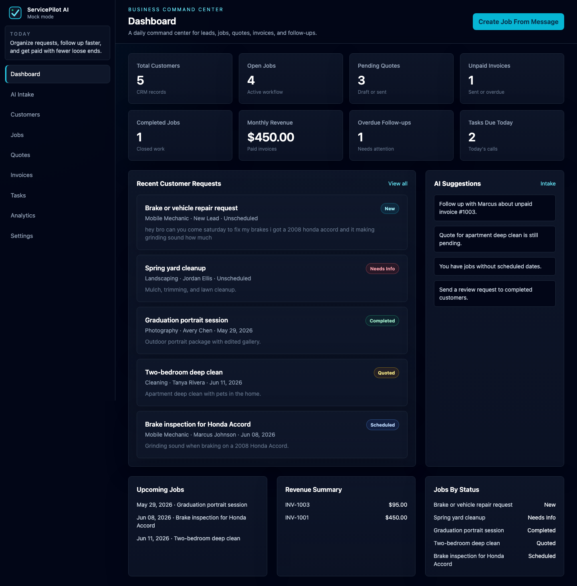
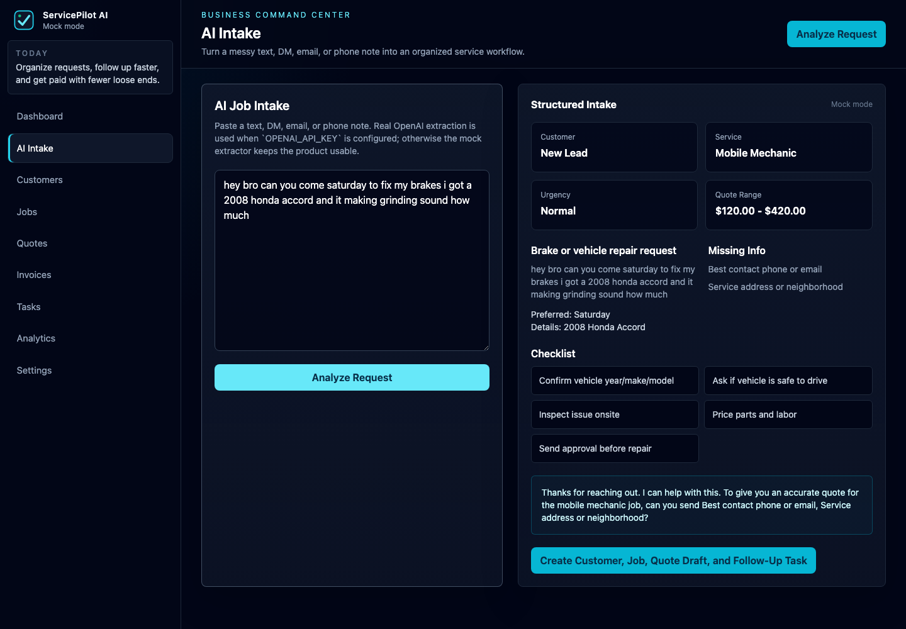
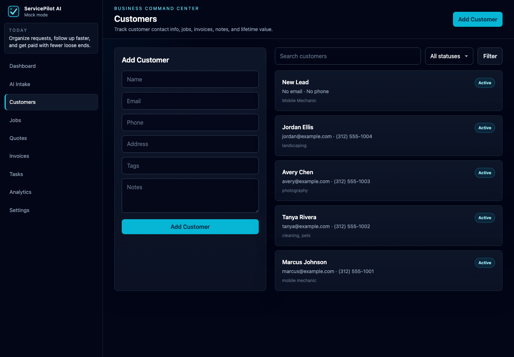
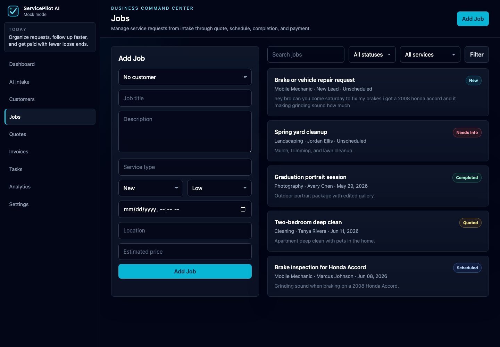
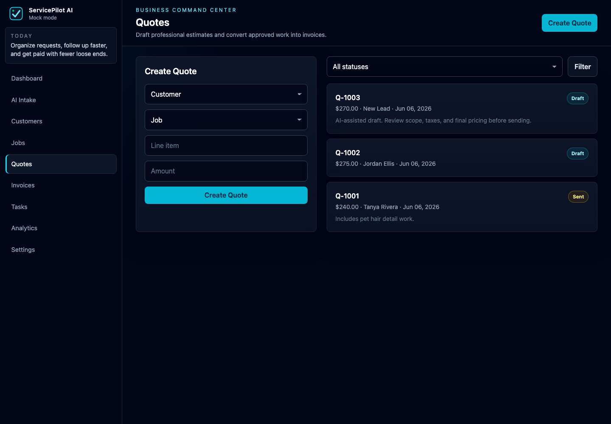
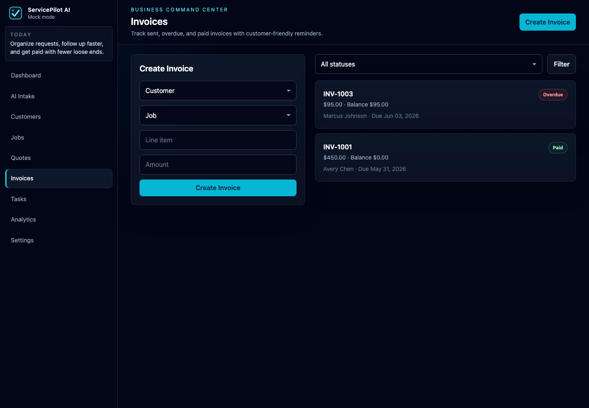
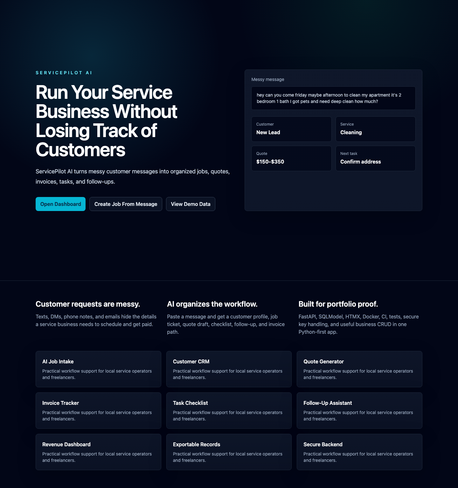
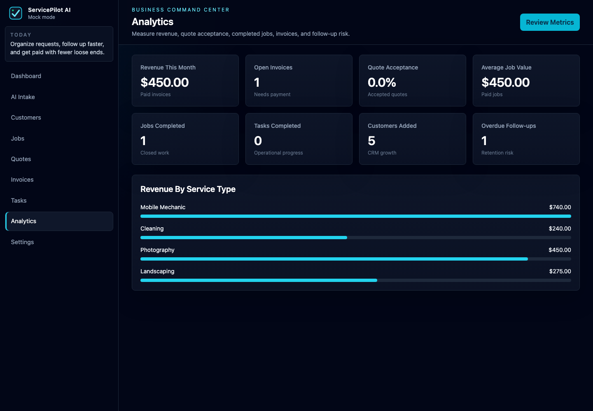

# ServicePilot AI

[](https://github.com/BeauDevCode/servicepilot-ai-python/actions/workflows/ci.yml)

**Live Demo:** [https://servicepilot-ai-python.onrender.com](https://servicepilot-ai-python.onrender.com)

**Turn messy customer requests into organized jobs, quotes, invoices, and follow-ups.**

ServicePilot AI is a Python-first SaaS MVP for small local service businesses and freelancers. It helps mobile mechanics, cleaners, tutors, landscapers, photographers, handymen, barbers, and student entrepreneurs convert scattered texts, DMs, emails, and phone notes into durable business records.

**Reviewer guide:** [`docs/REVIEW_GUIDE.md`](docs/REVIEW_GUIDE.md)  
**Case study:** [`docs/CASE_STUDY.md`](docs/CASE_STUDY.md)

## Why This Project Matters

ServicePilot AI is a vertical workflow SaaS app, not a generic chatbot. The AI assistant does not stop at a conversational answer. It turns messy customer language into structured records: customers, jobs, quote drafts, invoices, follow-up tasks, checklists, and customer-ready messages.

That makes the app useful as a real small-business workflow and strong as a portfolio project because it shows backend modeling, product thinking, UI design, AI integration, testing, Docker, and CI in one coherent Python application.

## Screenshots

| Dashboard | AI Intake |
| --- | --- |
|  |  |

| Customers | Jobs |
| --- | --- |
|  |  |

| Quotes | Invoices |
| --- | --- |
|  |  |

| Landing | Analytics |
| --- | --- |
|  |  |

## Recruiter Quick Review

- **Backend:** FastAPI routes, dependency-injected database sessions, SQLModel persistence, Pydantic AI schema validation.
- **Frontend:** Server-rendered Jinja2 templates, HTMX-ready forms, Tailwind CSS, polished dark SaaS dashboard.
- **AI:** OpenAI integration behind `OPENAI_API_KEY`, with deterministic mock mode when no key exists.
- **Data model:** Customers, jobs, quotes, invoices, tasks, and business settings with real relationships.
- **Quality:** pytest, Ruff, GitHub Actions, Dockerfile, Docker Compose, seeded demo data, and clear docs.
- **Security basics:** Secrets live in environment variables; `.env` and SQLite database files are ignored.

## User Workflow

Paste a messy customer message:

```text
hey bro can you come saturday to fix my brakes i got a 2008 honda accord and it making grinding sound how much
```

ServicePilot AI extracts:

- customer name/contact details when available
- service category
- job title and description
- vehicle, property, or project details
- urgency and preferred timing
- missing information to ask for
- suggested quote range
- job checklist
- follow-up message

Then one click creates:

- customer profile
- job ticket
- quote draft
- follow-up task

## Features

- AI job intake from messy texts, DMs, emails, and phone notes
- Customer CRM with notes, tags, lifetime value, and related records
- Job tracking with statuses, priorities, scheduling, checklists, and notes
- Quote generator with professional quote detail pages
- Invoice tracker with balances, paid status, and reminder messages
- Task checklist for calls, confirmations, reminders, and reviews
- Analytics dashboard for revenue, quote acceptance, open invoices, completed jobs, and overdue follow-ups
- Settings page for business profile, default tax rate, service area, currency, and AI mode
- CSV export endpoints for customers and jobs

## Architecture

```text
FastAPI app
  routes/        HTTP endpoints and page actions
  services/      business logic for CRM, jobs, quotes, invoices, analytics, AI
  models.py      SQLModel tables and relationships
  schemas.py     Pydantic response/data contracts
  ai.py          OpenAI + mock extraction
  templates/     Jinja2 UI
  static/        CSS, JS, logo
  tests/         pytest coverage
```

The app uses server-rendered HTML for speed and simplicity, SQLModel for typed relational data, and a service layer to keep workflow logic reusable and testable.

## Code Tour

- `app/main.py` wires FastAPI, static files, lifespan startup, routers, and demo seed behavior.
- `app/models.py` defines the customer, job, quote, invoice, task, and settings tables.
- `app/database.py` configures SQLite and creates the database parent directory automatically for CI, Docker, and fresh clones.
- `app/ai.py` contains the OpenAI integration and deterministic mock parser.
- `app/services/` contains workflow logic for customers, jobs, quotes, invoices, tasks, analytics, exports, and AI.
- `app/routes/` contains FastAPI route modules for the landing page, dashboard, CRUD pages, analytics, settings, and API endpoints.
- `app/templates/` contains reusable Jinja2 components and polished SaaS pages.
- `tests/` covers health, core pages, AI mock parsing, workflow creation, services, analytics, settings, quote totals, invoice balance, and task completion.
- `.github/workflows/ci.yml` runs dependency install, Ruff, and pytest on GitHub Actions.

## Best Files to Review

- `docs/REVIEW_GUIDE.md`
- `docs/CASE_STUDY.md`
- `app/main.py`
- `app/models.py`
- `app/database.py`
- `app/ai.py`
- `app/services/`
- `app/routes/`
- `app/templates/`
- `tests/`
- `.github/workflows/ci.yml`

## Tech Stack

- Python 3.11+
- FastAPI
- Jinja2
- HTMX
- Tailwind CSS
- SQLite
- SQLModel
- Pydantic
- OpenAI API
- pytest
- Ruff
- Docker
- Docker Compose
- GitHub Actions

## Quick Start

```bash
git clone https://github.com/BeauDevCode/servicepilot-ai-python.git
cd servicepilot-ai-python
python -m venv .venv
source .venv/bin/activate
pip install -r requirements.txt
uvicorn app.main:app --reload
```

Open [http://localhost:8000](http://localhost:8000).

The app seeds demo data automatically when `DEMO_MODE=true`, which is the default.

## AI Mock Mode

The app works without an OpenAI API key. If `OPENAI_API_KEY` is missing, ServicePilot AI uses a deterministic mock parser that recognizes common service-business signals such as vehicle repair, apartment cleaning, landscaping, photography, tutoring, and home repair.

This keeps local development, portfolio demos, Docker, and CI reliable without external API calls.

To use real OpenAI extraction:

```bash
cp .env.example .env
OPENAI_API_KEY=sk-your-key
OPENAI_MODEL=gpt-4.1-mini
```

Never commit `.env`.

## Tests and CI

```bash
ruff check .
pytest -vv
```

GitHub Actions runs the same quality gate on every push and pull request:

- install dependencies from `requirements.txt`
- run `ruff check .`
- run `pytest`
- use safe mock-mode environment variables
- create SQLite folders automatically at app startup

## Docker

```bash
docker compose up --build
```

Open [http://localhost:8000](http://localhost:8000).

Docker Compose sets a container-local SQLite database path and demo mode by default.

## Pages

- `/` landing page
- `/dashboard` business dashboard
- `/ai-assistant` AI intake workflow
- `/customers` CRM
- `/jobs` job board
- `/quotes` quote management
- `/invoices` invoice tracking
- `/tasks` follow-up task list
- `/analytics` business insights
- `/settings` business and environment settings
- `/api/health` health check

## Security Notes

- API keys are loaded from environment variables.
- `.env` and SQLite database files are ignored by git.
- Real AI output is validated through a Pydantic schema.
- Mock mode avoids external network calls in tests and demos.
- The app contains no hardcoded local machine paths.

## Resume Bullets

- Built ServicePilot AI, a Python FastAPI SaaS MVP that converts messy customer service messages into structured customers, jobs, quote drafts, invoices, tasks, and follow-ups.
- Designed SQLModel data models for CRM, job tracking, quotes, invoices, business settings, and task workflows backed by SQLite.
- Integrated OpenAI behind environment-based configuration with a deterministic mock AI fallback for safe demos, local development, Docker, and CI.
- Implemented a polished server-rendered dashboard using Jinja2, HTMX-ready forms, Tailwind CSS, reusable template components, and responsive dark SaaS UI patterns.
- Added Docker, Docker Compose, pytest coverage, Ruff linting, GitHub Actions CI, seeded demo data, screenshots, and professional project documentation.

## Interview Talking Points

- Why this is a workflow product instead of a generic chatbot: AI output becomes durable business records.
- How the mock AI fallback protects demos and CI from external API failures or missing secrets.
- How SQLModel relationships connect customers, jobs, quotes, invoices, and tasks.
